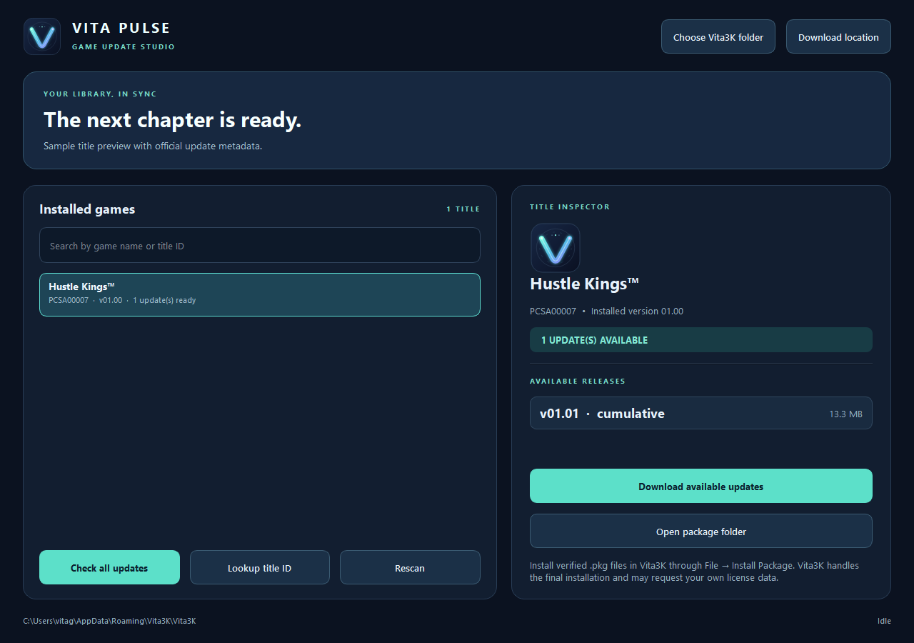

# Vita Pulse

**A polished Windows game update companion for Vita3K.** Vita Pulse scans the games already installed in your Vita3K library, checks Sony's official PS Vita update feed, and downloads update packages with size and SHA-1 verification. Its package inspector keeps each game's releases together.




## What it does

- Finds installed games from Vita3K's `ux0/app` content folder and reads titles, versions, and icons from `param.sfo`.
- Compares the installed base or patch version with official update metadata. You can also look up an exact title ID.
- Shows each release's version, type, and download size.
- Downloads all newer packages in version order, including any incremental steps.
- Verifies every downloaded package against Sony's reported size and SHA-1 before offering it for installation.
- Keeps packages in `Downloads/Vita3K Game Updates/<TITLE_ID>/` by default.

## Installing updates

Vita Pulse downloads and verifies the packages. To install them, open the package folder and use **File → Install Package (.pkg)** in Vita3K, in version order. Vita3K performs the final installation and may ask for license data from your own copy of the game. Vita Pulse does not supply licenses or modify your game or save folders.

Vita3K's [FAQ](https://vita3k.org/faq) documents package installation, and its [quickstart](https://vita3k.org/quickstart) explains supported dump formats and content locations.

## Run from source

Requires Windows and Python 3.11 or newer.

```powershell
py -m venv .venv
.\.venv\Scripts\Activate.ps1
python -m pip install -r requirements.txt
python main.py
```

## Build the Windows executable

```powershell
python -m pip install Pillow pyinstaller
python tools/build_icon.py
python -m PyInstaller --noconfirm --clean vita-pulse.spec
```

The bundled executable is `dist/vita-pulse.exe`. The build script creates `assets/vita-pulse.ico` from the original Vita Pulse mark and embeds it in the executable. GitHub Actions also builds an executable on every push and publishes it for version tags.

## Source and security

Vita Pulse computes Sony's update metadata URL from a title ID, reads the XML from a certificate-valid PlayStation CDN host, and rewrites package links to the same HTTPS host. It rejects package URLs outside the expected PlayStation path, checks expected length, and verifies SHA-1 after download. SHA-1 here is the value Sony publishes for these historical update packages; transport security is provided by TLS.

The update feed format is described by the [Vita developer wiki](https://www.psdevwiki.com/vita/Online_Connections). The HMAC lookup format and key are documented in [VitaDB's update reader](https://github.com/VitaSmith/VitaDB/blob/master/Update.cs). Vita Pulse is an independent community tool and is not affiliated with Vita3K or Sony.

## License

MIT. See [LICENSE](LICENSE).


